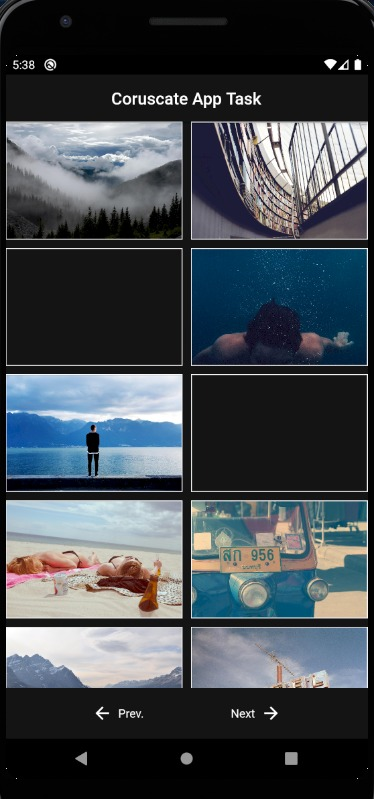

# Coruscate Task

A new project for Coruscate and Zujo

# Project Description

You have to create a mobile application to load images from the following URL
into local database.
URL: https://picsum.photos/v2/list?page=1&limit=10

# Requirements

1) Show images in a 2 column grid.
2) Show a random image from local database every time user open’s the
   application.
3) Pagination must be there when loading images and it should load only 10 images
   per page.
   
# Constraints

1) Design of your web app needs to be match with https://www.coruscate.com/
2) You can develop this app Android, IOS, React Native or Flutter.

# Instructions:
1) Follow good code standards and divide your components presentation and
   containers.
2) Be as genuine as possible.

# Technology Used:

* Flutter

# Language Used:

* Dart Language
# Home Page:

